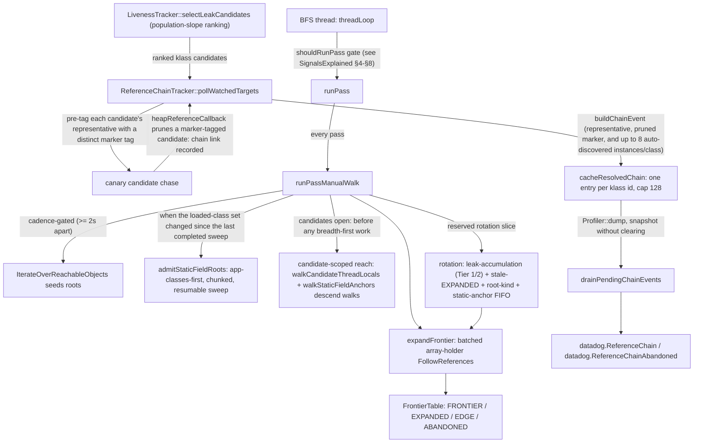
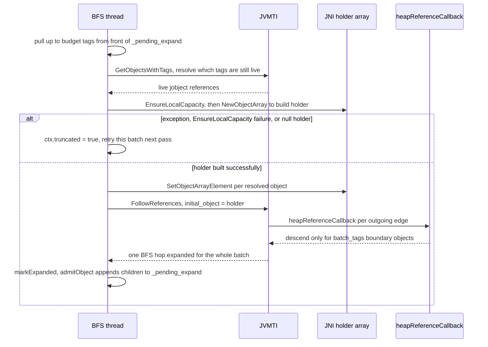
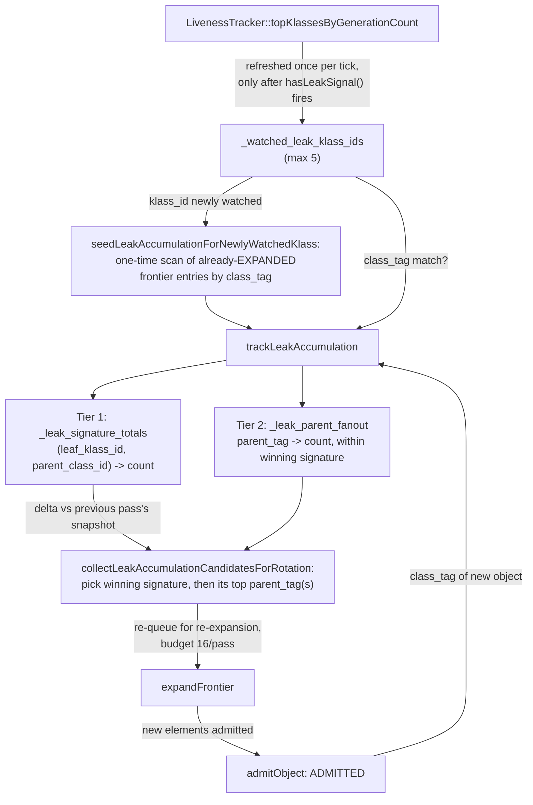
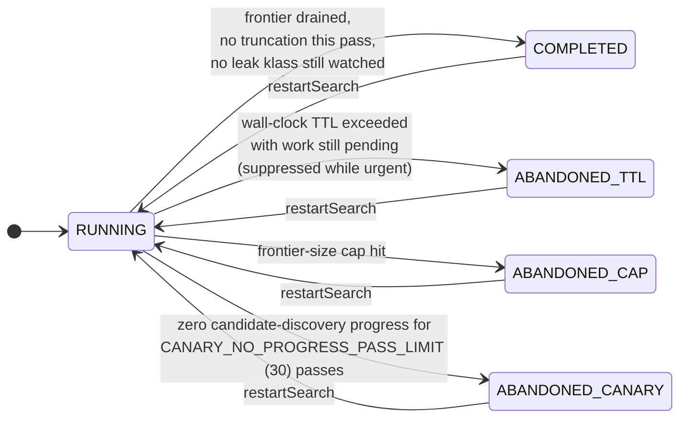

# Live Heap Reference Chains — As-Built Implementation Reference

**Status:** matches `jb/reference-chains` as of 2026-09
**Jira:** [PROF-15341](https://datadoghq.atlassian.net/browse/PROF-15341)

This document is the detailed, as-built reference for the reference-chain walk
engine. It records the mechanisms exactly as implemented, with the rationale
that lives in the code comments distilled into one place.

Companion documents, each with its own scope:

| Document | Scope |
|---|---|
| `doc/reference-chains-design.md` | The original design decision: why bounded BFS-from-roots was chosen over the alternatives |
| `doc/reference-chains-collection-summary.md` | The four-component summary: detection signal, resumable walk, latency budgets, rotation |
| `doc/architecture/LiveHeapReferenceChains.md` | The full architecture: frontier/tag lifecycle, triggering, termination, data structures |
| `doc/architecture/ReferenceChains-SignalsExplained.md` | A guided tour of the *scheduling* side: cadence, leak-signal gate, pain budget, PID controller, canary backoff, OOM ramp, abort path |

This document covers what none of the above covers in one place: the pass
structure, root discovery (including static-field roots), candidate-scoped
reach, the canary tagging mechanics, the rotation tiers, the as-built
pacing/budget arithmetic, and the `LivenessTracker` admission boost. Where a
topic belongs to the signals tour (scheduling behavior), this document
cross-references it instead of repeating it.

---

## 1. Data flow

Every pass is driven by the manual walk (`runPassManualWalk()`): pure JVMTI
heap calls, which run inside the `VM_HeapWalkOperation` safepoint and honor
ZGC's load barriers — the walk reads no raw oop, so concurrent relocation
cannot corrupt it. The phases below run in this order, each with its own
deadline slice (the per-sub-operation deadline is reset, so an earlier phase
cannot eat a later phase's slice):

1. root/stack-ref enumeration (cadence-gated),
2. candidate thread-local descend walks (when a chase is open),
3. static-field sweep (when the loaded-class set changed),
4. `expandFrontier()` (ordinary breadth-first progress),
5. static-anchor descend walks,
6. rotation re-expansion.

A rotation slice is reserved up front, before any of the above can spend the
whole pass budget. The reservation is capped at half the expand budget: a
pacing-throttled pass degrades both sides proportionally instead of starving
ordinary expansion to zero (or rotation to zero).

## 2. Root discovery

### 2.1 Root/stack-ref enumeration

`IterateOverReachableObjects` walks the roots and dispatches
`heapRootCallback()`/`stackRefCallback()`. Root enumeration pays its fixed
root-walk-and-dispatch cost in full on every run, regardless of budget, so it
is gated by `ROOT_ENUM_MIN_INTERVAL_NS` (2s): it does not re-fire at the
per-second pass cadence. A budget-exhausted truncation here retries on the
next pass; a frontier-cap hit abandons the search (below). Note that root
enumeration alone never discovers a root's transitive children — the
callbacks are given no oop, only a tag pointer — so `expandFrontier()` is
always needed for further progress, first pass or resumed.

### 2.2 Static-field roots (`admitStaticFieldRoots()`)

An object held only by `SomeClass.staticField` is not reachable through
`IterateOverReachableObjects`' root/stack-ref callbacks at all. This is
precisely the leak shape production pods showed: a growing `static final`
collection. The sweep:

- Repartitions the per-call `GetLoadedClasses()` array app-classes-first (any
  non-bootstrap classloader), in place, every call — `GetLoadedClasses()`
  gives no ordering guarantee across calls, so the sweep reprioritizes each
  time. A likely leak source is reached within the first chunks instead of
  after every JDK platform class.
- Advances `STATIC_FIELD_SWEEP_CHUNK_CLASSES` (512) classes per pass through
  a resumable cursor (`_static_field_sweep_cursor`). A single un-chunked
  `FollowReferences` over every loaded class could not finish inside one
  pass's safepoint deadline on a JVM with tens of thousands of classes.
- Retries a truncated chunk on the next pass; a lap that truncated even once
  is not marked done (`_static_field_sweep_cycle_truncated`), per the
  subsystem's "no silent truncation" contract.
- Only runs at all when the loaded-class set has *actually changed* since the
  last completed lap (`_last_static_field_class_count` differs from the count
  `resolveLoadedClasses()` refreshed this same pass). Otherwise it would
  re-pay a stop-the-world walk over every class on every pass, forever.
- Admits `STATIC_FIELD` edges always; caps non-static class edges
  (constant-pool, interface, superclass, classloader) at
  `STATIC_FIELD_SWEEP_NON_STATIC_CAP_PER_CLASS` (32) per class, so one outlier
  class cannot blow the chunk's deadline.

### 2.3 Candidate-scoped reach (descend walks)

Once a candidate chase is open, breadth-first progress alone can leave the
tagged instances queued behind the ordinary backlog for many passes. Each
open chase therefore gets bounded *descend walks* — `FollowReferences` from a
specific anchor, up to `DESCENT_HOPS` (16) hops below it (raised from 6 after
pod round 7: the static-`ExecutorService` → queue → task → accumulator →
list → chunk shape is ~7 deep; the walk is deadline-bounded per slice either
way, so a deeper cap just lets each bounded walk cover the whole holder
interior — already-admitted entries are skipped, so repeated passes march
deeper each time):

- **Prong 1, thread-locals** (`walkCandidateThreadLocals()`): descend-walks
  the qualifying threads' `Thread` objects — registered via
  `Profiler::onThreadStart/onThreadEnd`
  (`registerThreadObject()`/`unregisterThreadObject()`, a mutex-guarded
  tid → global-ref map; a running thread's `Thread` object is reachable via
  the VM anyway, so the strong ref does not distort reachability) — through
  their `ThreadLocalMap` subgraphs. A `Thread → ThreadLocalMap → table[] →
  Entry → value → holder → chunk` chain is 5-6 hops that ordinary BFS may
  reach very late, if at all. Capped at `THREAD_WALK_MAX_ANCHORS` (4) per
  pass, rotated fairly across the (klass, tid) pairs by a cursor.
- **Prong 2, static anchors** (`walkStaticFieldAnchors()`): descend-walks
  root-attached static holders. Anchors are selected by
  `collectStaticFieldAnchorsForRotation()` with *tiered* per-tier cursors
  (fresh container-interface holders first); classes are classified once by
  `reconcileAnchorClassShapes()` (capped at
  `ANCHOR_SHAPE_RECONCILE_BUDGET` = 128 distinct classes per pass —
  `resolveContainerInterfaceTags()`/`classImplementsContainerOrMap()` decide
  whether a class implements a `Collection`/`Map`-like interface); at-risk
  holders (frontier entries whose parent died) flow through a FIFO
  (`pushAtRiskStaticAnchor()`/`drainStaticAnchorFifo()`, popped
  `STATIC_ANCHOR_FIFO_DRAIN` = 16 per pass). Capped at
  `STATIC_ANCHOR_ROTATION_BUDGET` (32) anchors per pass. Selection size and
  walked size are decoupled: a truncation requeues un-walked anchors
  (`requeueStaticAnchorFifoFront()`), so a larger selection never extends the
  pause — it can only spend selection-scan time, which holds no safepoint.

Both prongs resolve their anchor batch with a single `GetObjectsWithTags`
call (the call's O(tag_map) cost is the dominant term on a large tag map —
the same batching rationale as `expandFrontier()`).

## 3. Frontier expansion and batching

`expandFrontier()` resolves up to `budget` pending tags in *one*
`GetObjectsWithTags` call, packs the live objects into a single JNI array
(`holder`), and expands the whole batch via exactly one
`FollowReferences(initial_object = holder)` — one BFS level per
VM-safepoint operation rather than one safepoint per entry:

The JNI/JVMTI error handling is defensive by construction: a null `holder`,
a pending JNI exception after `NewObjectArray`/`SetObjectArrayElement`, or an
`EnsureLocalCapacity` failure all set `ctx.truncated = true` (retry next
pass) instead of marking the batch permanently `EXPANDED`. A failed
`java/lang/Object` class resolution with pending work also forces
`truncated = true`, so `runPass()` cannot mistake it for
`SearchState::COMPLETED`.

## 4. The canary candidate chase

`pollWatchedTargets()` pre-tags each candidate's *specific representative
object* (identity match — matching by class alone could record a chain for an
unrelated, possibly short-lived, instance of the same class) with a distinct
negative marker tag (`MARKER_TAG_BASE - i`; the negative range is disjoint
from the positive frontier-tag counter and the negative class-tag range).
When the walk's `heapReferenceCallback()` later encounters one, it *prunes*
it: records the candidate's referrer link (parent tag, referrer klass,
depth) for `buildCanaryChainEvent()`, and does not expand through it.

The walk also auto-marks *any* instance of a watched class it discovers (up
to `MAX_DISCOVERED_INSTANCES_PER_CLASS` = 8 per slot): a leaking class's
many live instances each have independently useful chains — different
parents, different retention paths — and the pre-tagged representative is
just one sample.

The chase's *scheduling* (back-to-back on progress, work-scaled exponential
backoff on no progress, pain-budget refill) is covered in
`ReferenceChains-SignalsExplained.md` §8, including the measured pod incident
(32 minutes at ~88 passes/min) that motivated the backoff. The *termination*
half is here: a chase that has made zero candidate-discovery progress for
`CANARY_NO_PROGRESS_PASS_LIMIT` (30) consecutive passes is abandoned with
`SearchAbandonReason::CANARY_STUCK`. Unlike the TTL check, this fires even
while `isUrgent()` holds: a zero-progress chase at urgency-boosted
budget/cadence only burns STW pause budget the process needs during the same
OOM approach the chase was launched to diagnose. The abandon limit *widens*
with repeated stuck restarts (`_canary_stuck_restart_count` survives
`restartSearch()`), so a permanently un-findable candidate cannot keep
cycling at the base limit.

## 5. Rotation: rediscovering growth in an already-visited container

The frontier walk visits each object once. That is insufficient for the leak
shape this feature targets: a `static final` collection field that is
*appended to*, not reassigned. The container is already `EXPANDED` long
before its element klass earns a leak signal. `runPass()`'s completion branch
therefore requires `_watched_leak_klass_count == 0` (no klass under active
leak watch) before moving to `SearchState::COMPLETED`; while a klass is
watched, the search stays `RUNNING` and rotation re-queues the growing
container:

Matching a newly-admitted object against a watched klass id uses a stable
JVMTI class tag (`classTagAllocator.h`, shared between
`ReferenceChainTracker` and `LivenessTracker`) rather than the classMap
`StringDictionary` id — that id is not guaranteed stable if the dictionary
is compacted/regenerated mid-search (observed live: the same class resolved
to two different classMap ids from two subsystems).

The rotation tiers, with their per-pass budgets:

| Tier | Budget/pass | What it selects |
|---|---|---|
| Leak-accumulation (Tier 1/2 above) | 16 | The containers of currently-flagged klasses — the targeted tier |
| Stale-EXPANDED (own cursor) | 256 | Any long-`EXPANDED` entry — low-priority eventual coverage of the whole table; deliberately *not* scaled with table size (two earlier versions tried; see git history) |
| Root-kind (own cursor) | 16 | Transient-root entries, so attribution converges to a durable root kind |
| Static-anchor FIFO | 16 drained | At-risk holders whose parent died, into the same `walkStaticFieldAnchors()` batch |

The stale-EXPANDED tier's own cursor exists so a frontier table full of
long-lived infrastructure objects cannot permanently starve higher-tag
entries of ever being re-queued.

## 6. Termination

The abandon reason is recorded (`SearchAbandonReason`) and surfaced as the
`datadog.ReferenceChainAbandoned` JFR event — no silent truncation.
`releaseSearchTags()` clears every live tag the search still owns once it
ends, without discarding the frontier table's own records: chain
reconstruction keeps working from memory after the search ends.

Restarts are gated on an actual leak indication (a
`selectLeakCandidates()` candidate, or an urgent-latched seconds-to-OOM
projection — one search per latched episode via `_urgent_search_spent`) plus
the safepoint pain budget. This closes a structural gap: a one-shot walk
could finish before population-trend detection accumulated enough GC epochs
to flag a candidate, leaving anything allocated afterward permanently
undiscoverable. See `ReferenceChains-SignalsExplained.md` §5-§6 for the
gate's full behavior.

## 7. Pacing and budgets (as-built arithmetic)

- **PID controller on genuine in-safepoint time.** `updatePacing()` is fed
  only each pass's in-safepoint ticks — measured across every
  `IterateOverReachableObjects`/`FollowReferences` call the pass makes,
  explicitly excluding `GetObjectsWithTags` (not a safepoint call) and every
  bookkeeping line in between. Non-safepoint bookkeeping must not be
  mistaken for pause-time-SLO pressure. The controller's overflow term also
  widens/narrows the fallback cadence.
- **Separate CPU pain budget.** Non-safepoint pass cost is charged to
  `_cpu_pain_budget`, a second `PainBudget` sharing the same
  `painbudget=N` percent knob as the safepoint pain budget — one
  operator-facing "acceptable background cost" percentage covers both leaky
  buckets.
- **Budget borrowing.** A sustained run of comfortably-under-target passes
  (after a warmup) earns extra headroom above `_budget`
  (`_borrowed_budget`); any pass that is not comfortably under target
  revokes it immediately (`maybeRevokeBorrowForRootEnumPass()` also revokes
  on a root-enum pass), so `_budget` itself stays the ceiling the instant
  the search stops proving it has room.
- **First-pass budget.** The search's one-shot root-seeded first pass draws
  its own much larger edge budget (`firstpassbudget`, auto-scaled 10× from
  `budget`, capped) exactly once — a steady-state budget sized for cheap
  incremental expansion would truncate a cold full-graph walk long before
  it reaches anything interesting — and its duration is excluded from the
  pacing signal so it cannot throttle every cheap pass that follows.
- **Urgency ramp.** See `ReferenceChains-SignalsExplained.md` §9: pause
  target and cadence ramp exponentially toward their ceilings as
  `secondsToOOM()` falls inside `OOM_RAMP_START_S` (30 min); the budget
  ceiling is held at 4× for the ramp's entire duration; the ramp owns
  `_effective_cadence_ns` outright while active.
- **Auto-tuned defaults.** `autoTuneDefaults()` scales the defaults for
  budget (√heap-proportional), first-pass budget, TTL, frontier cap, and
  pause target (capped at 50ms) with the resolved max heap / container
  limit, but only for sub-options the operator did not set explicitly.

The urgency *latch* is covered in `ReferenceChains-SignalsExplained.md` §9.
On the `LivenessTracker` side, `secondsToOOM()` itself: accounts for the
container memory limit (not just `-Xmx`) when projecting the exhaustion
point; requires a confirmed rising heap-floor trend; and corroborates the
projection with a recent-half slope check, so a single stale sample cannot
spike or collapse it.

## 8. `LivenessTracker` admission boost (chase phase)

While a candidate chase is open, allocations by the candidates' *qualifying
threads* are admitted to liveness tracking at 100% (`admitForTracking()`,
published two-phase — slots first, then the count with RELEASE — by
`noteSelectedCandidates()`), and urgency admits everything. Without this,
the default 10% liveness subsampling thins small per-(klass, tid)
populations enough to make leak-tag correlation intermittently fail on real
pods (observed live as the intermittent zero-tag runs in
`LeakTagCorrelationReferenceChainTest`'s own lottery analysis). The boost
only ever adds admissions on top of the configured ratio — fail-open by
construction: a stale or missed boost cannot drop an allocation the ratio
would have admitted. The draw itself is the process-wide xorshift64 stream
from main's sampling refactor (#794): per-thread TLS state, an integer
threshold compare, no `<random>` machinery.

## 9. Output path and JFR persistence

A resolved chain is cached per klass id (`_resolved_chains`, capped at
`MAX_RESOLVED_CHAINS` = 128 entries, drop-not-evict once full — surfaced as
`REFERENCE_CHAIN_EVENTS_DROPPED`) and re-stamped into *every* subsequent
dump the sample survives into (`drainPendingChainEvents()` snapshots without
clearing, mirroring how `LivenessTracker` re-emits live-object samples). A
long-lived leak's chain is therefore present in each JFR chunk, not only in
the chunk active when it was first reconstructed. The write happens on the
dump thread (`Profiler::dump()`), never on the BFS thread — the walk never
blocks on JFR I/O, and JFR writes never trigger a walk.

## 10. Configuration

`referencechains=true:hops=N:budget=N:ttl=N:framecap=N:pausetarget=N:painbudget=N:firstpassbudget=N`

- Negative `hops`/`budget`/`framecap` values are floored (an unfloored
  negative `hops` would wrap to ~4e9 as a `u32`, silently disabling the cap
  it is meant to enforce); all three are also ceiling-clamped.
- `ttl <= 0` disables the wall-clock TTL cutoff.
- Unset values are auto-tuned (see §7).

## 11. Temporary diagnostics

Some `TEST_LOG_SUMMARY` output and tallies in the static-field sweep and the
anchor walk (chunk-consumption splits, per-`reference_kind` callback tallies,
walked-anchor naming) are *temporary diagnostic* instrumentation from the
live pod debugging rounds (`.investigations/missing-refchains-on-hotdog/`,
16 rounds) that shaped this design. They are pending removal once the
on-pod investigation notes are fully distilled. Production behavior does not
depend on them.
