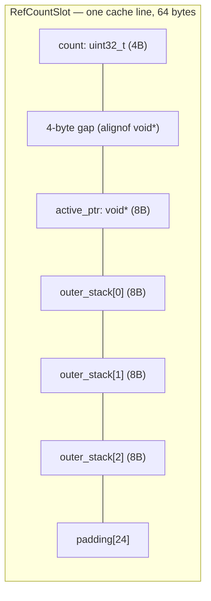
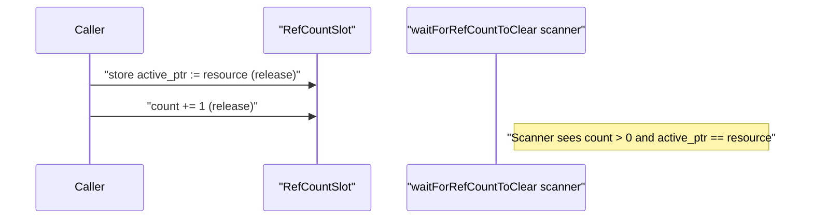
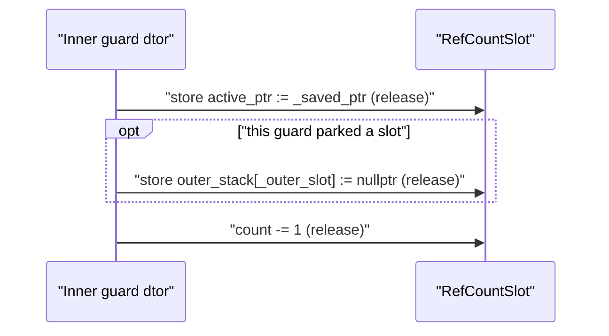
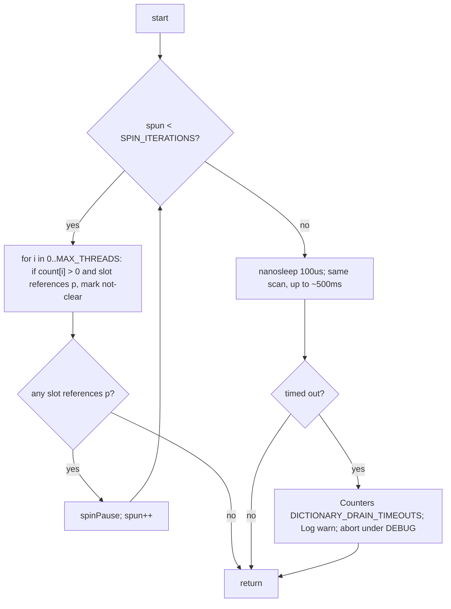

# RefCountGuard Protocol

`RefCountGuard` is a generic, lock-free, RAII reference-counting primitive used
to safely reclaim heap-allocated resources that may be accessed concurrently
from signal handlers.  Used by `StringDictionary` (buffer rotation) and
`CallTraceHashTable` (table rotation).

The protocol has three layers:
1. **Slot acquisition** — find a per-thread slot via prime-probing hash.
2. **Activation** — publish the protected pointer; increment the reference count.
3. **Drain** — `waitForRefCountToClear(p)` blocks until no slot references `p`.

Reentrant signal delivery is handled by parking displaced pointers in a
fixed-size `outer_stack[OUTER_STACK_DEPTH]` array on the slot, so the drain
scanner can see every resource currently in use, not just the innermost one.

---

## Slot layout (one cache line)



`active_ptr` is `alignas(alignof(void*))`, which forces a 4-byte gap after the
`uint32_t count` field on 64-bit targets.  The trailing `padding[]` is sized
by `DEFAULT_CACHE_LINE_SIZE - alignof(void*) - (1 + OUTER_STACK_DEPTH) * sizeof(void*)`
so the layout fits exactly one cache line; the `RefCountSlot` default ctor's
`static_assert(sizeof(RefCountSlot) == DEFAULT_CACHE_LINE_SIZE, ...)` catches
any drift at compile time.

`active_ptr` is the resource the *innermost* guard is protecting.
`outer_stack[i]` is the resource that was displaced when reentrant level i+1
fired (level 1 displaces to slot 0, level 2 to slot 1, ...).

---

## Construction — non-reentrant (root) case



`active_ptr` is stored **before** `count++` so the scanner never sees a stale
pointer for a live slot.

### Slot exhaustion

`getThreadRefCountSlot()` walks at most `MAX_PROBE_DISTANCE = 32` probe steps;
if none are free and none belong to the current tid with a live outer guard,
it returns `-1` and the ctor sets `_active = false`.  An inactive guard offers
**no protection** — the resource is invisible to the drain.  Callers that
require strict protection must check `isActive()`.  With `MAX_THREADS = 8192`
prime-probed by tid, exhaustion is effectively unreachable under normal
operation.

---

## Construction — reentrant case

A signal handler fires while an outer guard is still live on the same thread.
The slot probe returns `slot + MAX_THREADS` to flag reentrancy — but **only**
when the matched slot still has `count > 0`.  If the outer guard has already
decremented `count` to 0 (the brief window between `count--` and
`slot_owners[i] := 0` in the non-reentrant dtor), the probe falls through to
search for a fresh slot instead, so the new ctor cannot publish an `active_ptr`
that the outer dtor is about to overwrite with null.

```mermaid
sequenceDiagram
    participant Inner as "Inner guard ctor"
    participant Slot as "RefCountSlot"
    Inner->>Slot: "load _saved_ptr := active_ptr (acquire)"
    Inner->>Slot: "prev_count := count.fetch_add(1, release)"
    Note right of Inner: "prev_count is the reentrancy depth this guard occupies"
    alt "prev_count - 1 fits in OUTER_STACK_DEPTH"
        Inner->>Slot: "store outer_stack[prev_count - 1] := _saved_ptr (release)"
    else "depth exceeds OUTER_STACK_DEPTH"
        Inner->>Slot: "Log warn once per process; saved pointer invisible to scanner"
    end
    Inner->>Slot: "store active_ptr := resource (release)"
```

After step 3 (or step 4 on overflow), the slot contains:
- `count == prev_count + 1`
- `active_ptr == resource` (inner resource)
- `outer_stack[0..min(prev_count, OUTER_STACK_DEPTH)-1]` filled; deeper levels
  live only in the per-guard `_saved_ptr` and trigger the one-time overflow
  warning latched by `s_outer_stack_overflow_warned`.

The scanner walks `active_ptr` plus every entry of `outer_stack[]` and reports
the slot as matching if any of them equals the resource being drained.  The
target must be non-null: `nullptr` is the sentinel for "unused" outer-stack
slot, so `waitForRefCountToClear(nullptr)` is not a supported call.

---

## Destruction — reentrant case

Reverse of construction.  Restoring `active_ptr` *before* clearing
`outer_stack[_outer_slot]` *before* `count--` keeps the invariant
**"scanner sees the outer resource while count > 0"**.



Destruction — non-reentrant (root) case: the order is inverted —
`count--` first, then `active_ptr := nullptr`, then `slot_owners[slot] := 0`.
Scanner skips a slot whose `count == 0`, so a null `active_ptr` during the
deactivation window is never observed by a live drain.

---

## Worked example — depth-3 nesting

L0 = JNI lookup on resource `R0`.
L1 = signal handler on the same thread, lookup on resource `R1`.
L2 = nested signal (e.g. SIGSEGV crash handler during L1), lookup on `R2`.

```mermaid
sequenceDiagram
    participant L0 as "L0 (JNI)"
    participant L1 as "L1 (signal)"
    participant L2 as "L2 (nested signal)"
    participant Slot
    L0->>Slot: "store active_ptr := R0; count := 1"
    Note right of Slot: "active=R0, outer_stack=[null,null,null], count=1"
    L1->>Slot: "saved := R0; count := 2; outer_stack[0] := R0; active := R1"
    Note right of Slot: "active=R1, outer_stack=[R0,null,null], count=2"
    L2->>Slot: "saved := R1; count := 3; outer_stack[1] := R1; active := R2"
    Note right of Slot: "active=R2, outer_stack=[R0,R1,null], count=3"
    Note over Slot: "Scanner waiting for R1 sees outer_stack[1] = R1 and stays blocked"
    L2->>Slot: "active := R1; outer_stack[1] := null; count := 2"
    Note right of Slot: "active=R1, outer_stack=[R0,null,null], count=2"
    L1->>Slot: "active := R0; outer_stack[0] := null; count := 1"
    L0->>Slot: "count := 0; active := null; slot_owners := 0"
```

The pre-fix protocol (`outer_ptr` single pointer with `_set_outer_ptr`
discriminator) wrote `R0` to `outer_ptr` at L1 and refused to overwrite it
at L2, so `R1` was held only on L2's stack frame and invisible to the
scanner.  A `waitForRefCountToClear(R1)` running during L2 would return
prematurely.  With `outer_stack[OUTER_STACK_DEPTH]` every displaced resource
gets its own slot.

---

## Drain — `waitForRefCountToClear(p)`



A slot is considered to reference `p` if `active_ptr == p` or any entry of
`outer_stack[]` equals `p`.  Unused outer-stack entries are `nullptr` and
therefore never match a (non-null) drain target.

---

## Invariants

| Invariant | Enforced by |
|-----------|-------------|
| "Scanner never sees a stale `active_ptr` for a live slot" | `active_ptr` stored before `count++` (root); `active_ptr` restored before `count--` (reentrant) |
| "Every displaced resource on a reentrant chain is visible to the scanner up to OUTER_STACK_DEPTH" | `outer_stack[prev_count-1]` write in ctor; conditional clear in dtor |
| "No deadlock between drain and signal handler" | All scans are bounded; timeout is observable via counter and DEBUG abort |
| "Slot can be reclaimed after drain returns" | `slot_owners[i] = 0` is written only by the non-reentrant teardown path — destructor or move-assignment overwriting an active guard — and only after `count` has been decremented to 0 |
| "Nesting beyond OUTER_STACK_DEPTH is observable" | One-time `Log::warn` latched via `s_outer_stack_overflow_warned` |

---

## Files

- `ddprof-lib/src/main/cpp/refCountGuard.h` — class declaration, `RefCountSlot` layout, `OUTER_STACK_DEPTH`.
- `ddprof-lib/src/main/cpp/refCountGuard.cpp` — implementation, drain loop, overflow warning.
- `ddprof-lib/src/main/cpp/stringDictionary.h` — primary user; see [StringDictionary](StringDictionary.md).
- `ddprof-lib/src/main/cpp/callTraceHashTable.h` — secondary user.
