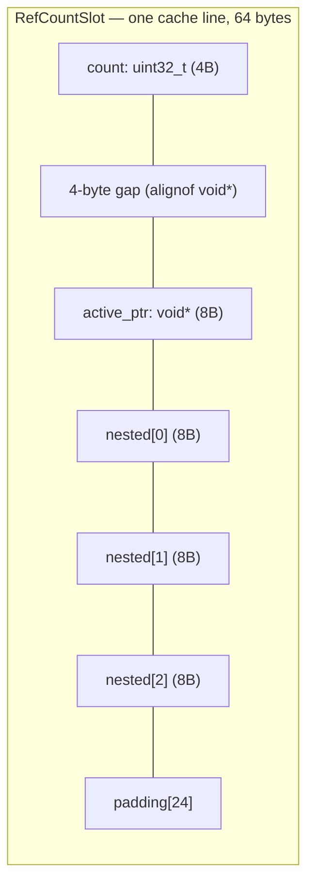
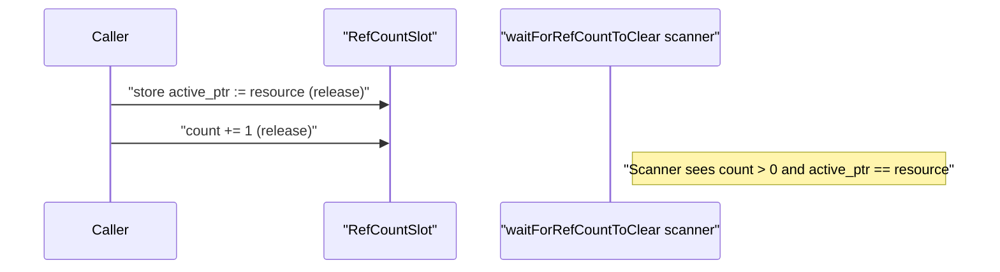
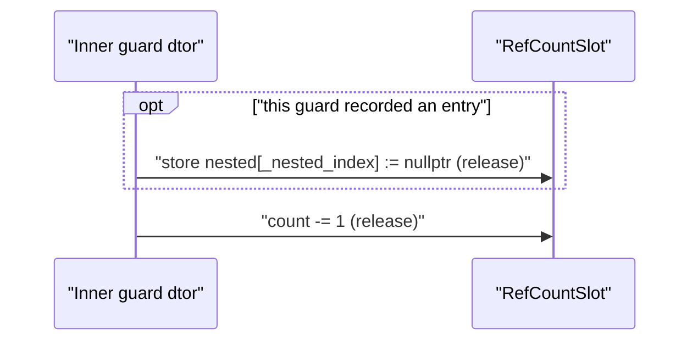
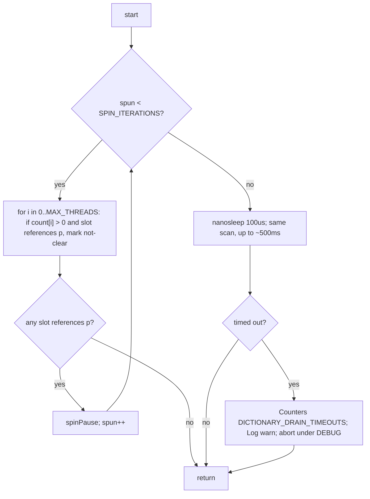

# RefCountGuard Protocol

`RefCountGuard` is a generic, lock-free, RAII reference-counting primitive used
to safely reclaim heap-allocated resources that may be accessed concurrently
from signal handlers.  Used by `StringDictionary` (buffer rotation) and
`CallTraceHashTable` (table rotation).

The protocol has three layers:
1. **Slot acquisition** — find a per-thread slot via prime-probing hash.
2. **Activation** — publish the protected pointer; increment the reference count.
3. **Drain** — `waitForRefCountToClear(p)` blocks until no slot references `p`.

Reentrant signal delivery is handled by giving each nested guard its own entry
in a fixed-size `nested[NESTED_DEPTH]` array on the slot, while `active_ptr`
keeps the root guard's resource.  No resource moves while it is protected, so
the drain scanner sees every resource currently in use with a single pass.

---

## Slot layout (one cache line)

```mermaid
flowchart LR
    subgraph slot ["RefCountSlot — one cache line, 64 bytes"]
        c["count: uint32_t (4B)"]
        g["4-byte gap (alignof void*)"]
        a["active_ptr: void* (8B)"]
        o0["nested[0] (8B)"]
        o1["nested[1] (8B)"]
        o2["nested[2] (8B)"]
        p["padding[24]"]
        c --- g --- a --- o0 --- o1 --- o2 --- p
    end
```

`active_ptr` is `alignas(alignof(void*))`, which forces a 4-byte gap after the
`uint32_t count` field on 64-bit targets.  The trailing `padding[]` is sized
by `DEFAULT_CACHE_LINE_SIZE - alignof(void*) - (1 + NESTED_DEPTH) * sizeof(void*)`
so the layout fits exactly one cache line; the `RefCountSlot` default ctor's
`static_assert(sizeof(RefCountSlot) == DEFAULT_CACHE_LINE_SIZE, ...)` catches
any drift at compile time.

`active_ptr` is the resource the *root* (outermost) guard is protecting.
`nested[i]` is the resource of the reentrant guard at depth i+1 (the first
nested signal uses `nested[0]`, a signal nested in that one `nested[1]`, ...).

---

## Construction — non-reentrant (root) case

```mermaid
sequenceDiagram
    participant Caller
    participant Slot as "RefCountSlot"
    participant Scanner as "waitForRefCountToClear scanner"
    Caller->>Slot: "store active_ptr := resource (release)"
    Caller->>Slot: "count += 1 (release)"
    Note right of Scanner: "Scanner sees count > 0 and active_ptr == resource"
```

`active_ptr` is stored **before** `count++` so the scanner never sees a stale
pointer for a live slot.

### Slot exhaustion

`getThreadRefCountSlot()` walks at most `MAX_PROBE_DISTANCE = 32` probe steps;
if none are free and none belong to the current tid with a live outer guard,
it returns `-1` and the ctor sets `_active = false`.  An inactive guard offers
**no protection** — the resource is invisible to the drain.  Callers that
require strict protection must check `isActive()`.  With `MAX_THREADS = 8192`
prime-probed by tid, exhaustion is effectively unreachable under normal
operation.

---

## Construction — reentrant case

A signal handler fires while an outer guard is still live on the same thread.
The slot probe returns `slot + MAX_THREADS` to flag reentrancy — but **only**
when the matched slot still has `count > 0`.  If the outer guard has already
decremented `count` to 0 (the brief window between `count--` and
`slot_owners[i] := 0` in the non-reentrant dtor), the probe falls through to
search for a fresh slot instead: the scanner treats a slot with `count == 0` as
holding at most an activation-window `active_ptr`, so a `nested[]` entry there
would be missed.

```mermaid
sequenceDiagram
    participant Inner as "Inner guard ctor"
    participant Slot as "RefCountSlot"
    Inner->>Slot: "prev_count := count.fetch_add(1, release)"
    Note right of Inner: "prev_count is the reentrancy depth this guard occupies"
    alt "prev_count - 1 fits in NESTED_DEPTH"
        Inner->>Slot: "store nested[prev_count - 1] := resource (release)"
    else "depth exceeds NESTED_DEPTH"
        Inner->>Slot: "Log warn once per process; this resource invisible to scanner"
    end
```

The nested guard never touches `active_ptr`, which keeps the root guard's
resource.  After construction the slot contains:
- `count == prev_count + 1`
- `active_ptr == ` the root guard's resource
- `nested[0..min(prev_count, NESTED_DEPTH)-1]` holding the nested guards'
  resources; a guard nested deeper than that is not recorded and triggers the
  one-time overflow warning latched by `s_nested_overflow_warned`.  That
  unrecorded guard is the innermost one - the handler running at that moment -
  whereas the earlier displacing protocol lost track of a suspended outer one.
  Either way a drain can then free a resource the thread uses once it
  continues, and it takes `NESTED_DEPTH + 1` nested signal deliveries on one
  thread.  Recording the innermost guard by overwriting an entry would move a
  protected resource again, which is what this protocol avoids.

The `nested[]` store is `SEQ_CST`.  The caller re-checks its resource right
after constructing the guard (`CallTraceStorage::put()` reloads
`_active_storage`, `StringDictionary` reloads `_accepting`), while a drainer
clears or swaps that pointer and then scans.  The store has to be visible
before the re-check load runs, which a RELEASE store does not guarantee (x86
store buffer; on arm64 an acquire load may pass it).  The root path gets that
ordering from the `count++` RMW after its `active_ptr` store; the scan starts
each pass with a `SEQ_CST` fence for the drainer side.

The scanner walks `active_ptr` plus every entry of `nested[]` and reports the
slot as matching if any of them equals the resource being drained.  The target
must be non-null: `nullptr` is the sentinel for an unused `nested[]` entry, so
`waitForRefCountToClear(nullptr)` is not a supported call.

---

## Destruction — reentrant case

Reverse of construction: clear this guard's `nested[]` entry, then `count--`.
`active_ptr` is left alone.

```mermaid
sequenceDiagram
    participant Inner as "Inner guard dtor"
    participant Slot as "RefCountSlot"
    opt "this guard recorded an entry"
        Inner->>Slot: "store nested[_nested_index] := nullptr (release)"
    end
    Inner->>Slot: "count -= 1 (release)"
```

Destruction — non-reentrant (root) case: the order is inverted —
`count--` first, then `active_ptr := nullptr`, then `slot_owners[slot] := 0`.
Scanner skips a slot whose `count == 0`, so a null `active_ptr` during the
deactivation window is never observed by a live drain.

---

## Worked example — depth-3 nesting

L0 = JNI lookup on resource `R0`.
L1 = signal handler on the same thread, lookup on resource `R1`.
L2 = nested signal (e.g. SIGSEGV crash handler during L1), lookup on `R2`.

```mermaid
sequenceDiagram
    participant L0 as "L0 (JNI)"
    participant L1 as "L1 (signal)"
    participant L2 as "L2 (nested signal)"
    participant Slot
    L0->>Slot: "store active_ptr := R0; count := 1"
    Note right of Slot: "active=R0, nested=[null,null,null], count=1"
    L1->>Slot: "count := 2; nested[0] := R1"
    Note right of Slot: "active=R0, nested=[R1,null,null], count=2"
    L2->>Slot: "count := 3; nested[1] := R2"
    Note right of Slot: "active=R0, nested=[R1,R2,null], count=3"
    Note over Slot: "Scanner waiting for R1 sees nested[0] = R1 and stays blocked"
    L2->>Slot: "nested[1] := null; count := 2"
    L1->>Slot: "nested[0] := null; count := 1"
    Note right of Slot: "active=R0 throughout"
    L0->>Slot: "count := 0; active := null; slot_owners := 0"
```

Earlier versions installed each nested guard's resource in `active_ptr` and
parked the displaced one in an `outer_stack[]` entry, moving it back on
destruction.  A resource could then be in one place when the scanner read the
other: a scan that read `active_ptr` while L1 was live, then `outer_stack[0]`
after L1 ended and before another nested guard parked `R0` there again, missed
`R0` although L0 held it throughout.  Keeping every resource in one place for
its whole protected lifetime removes that class of torn scan.

---

## Drain — `waitForRefCountToClear(p)`

```mermaid
flowchart TD
    start[start] --> spin{"spun &lt; SPIN_ITERATIONS?"}
    spin -->|"yes"| scan["for i in 0..MAX_THREADS: if count[i] &gt; 0 and slot references p, mark not-clear"]
    scan --> chk{"any slot references p?"}
    chk -->|"no"| done[return]
    chk -->|"yes"| pause["spinPause; spun++"]
    pause --> spin
    spin -->|"no"| sleep_loop["nanosleep 100us; same scan, up to ~500ms"]
    sleep_loop --> timeout{"timed out?"}
    timeout -->|"no"| done
    timeout -->|"yes"| warn["Counters DICTIONARY_DRAIN_TIMEOUTS; Log warn; abort under DEBUG"]
    warn --> done
```

A slot is considered to reference `p` if `active_ptr == p` or any entry of
`nested[]` equals `p`.  Unused `nested[]` entries are `nullptr` and therefore
never match a (non-null) drain target.  Because a protected resource never
changes location, one pass over `active_ptr` and `nested[]` sees it regardless
of how many nested guards start or end while the slot is read.

---

## Invariants

| Invariant | Enforced by |
|-----------|-------------|
| "Scanner never sees a stale `active_ptr` for a live slot" | `active_ptr` stored before `count++` and cleared after `count--` (root); never written by reentrant guards |
| "A protected resource never moves" | Root resource only in `active_ptr`, nested resources only in their own `nested[]` entry, from construction to destruction |
| "Every resource on a reentrant chain is visible to the scanner up to NESTED_DEPTH" | `nested[prev_count-1]` write in ctor; conditional clear in dtor |
| "No deadlock between drain and signal handler" | All scans are bounded; timeout is observable via counter and DEBUG abort |
| "Slot can be reclaimed after drain returns" | `slot_owners[i] = 0` is written only by the non-reentrant teardown path — destructor or move-assignment overwriting an active guard — and only after `count` has been decremented to 0 |
| "Nesting beyond NESTED_DEPTH is observable" | One-time `Log::warn` latched via `s_nested_overflow_warned` |

---

## Files

- `ddprof-lib/src/main/cpp/refCountGuard.h` — class declaration, `RefCountSlot` layout, `NESTED_DEPTH`.
- `ddprof-lib/src/main/cpp/refCountGuard.cpp` — implementation, drain loop, overflow warning.
- `ddprof-lib/src/main/cpp/stringDictionary.h` — primary user; see [StringDictionary](StringDictionary.md).
- `ddprof-lib/src/main/cpp/callTraceHashTable.h` — secondary user.
