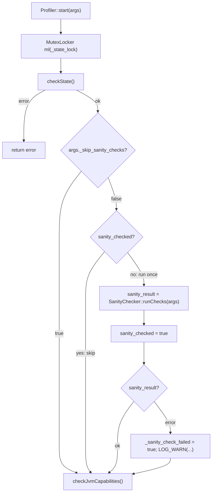

# Pre-Start Sanity Checks

`SanityChecker::runChecks()` (`ddprof-lib/src/main/cpp/sanityCheck.cpp`) checks,
on `Profiler::start()`, whether the host is too resource-constrained to run the
profiler safely — insufficient CPU headroom, or insufficient memory headroom
for the JVM's own configured footprint plus the profiler's overhead. A failed
check does not abort startup: the resource estimate is inherently approximate,
so `Profiler::start()` logs a warning and records the failure for the running
JFR recording instead of refusing to profile.

---

## Integration point



(`ddprof-lib/src/main/cpp/profiler.cpp`, `Profiler::start()`.) The check runs
immediately after `checkState()` and before `checkJvmCapabilities()`, but a
failing check does not return early — `Profiler::start()` always continues to
`checkJvmCapabilities()` and the rest of startup.

### One-time check

```cpp
static bool sanity_checked = false;
if (!sanity_checked) {
  sanity_checked = true;
  if (!args._skip_sanity_checks) {
    Error sanity_result = SanityChecker::runChecks(args);
    if (sanity_result) {
      _sanity_check_failed = true;
      _sanity_check_message = sanity_result.message();
      LOG_WARN("Continuing to start profiler despite failed sanity check "
               "(see JFR settings for details).");
    }
  }
}
```

`sanity_checked` is a function-local static with no lock of its own. This is
safe **only** because every call to this block happens while the caller
already holds `_state_lock` (`MutexLocker ml(_state_lock)` at the top of
`Profiler::start()`) — the lock is what makes "check exactly once" hold, not
anything inside `runChecks()` itself. The check runs at most once per process,
on the assumption that CPU/memory availability does not change during a
profiler session. Adding a new call path to `SanityChecker::runChecks()` that
is not under `_state_lock` (or is not otherwise the sole caller) would break
the once-only guarantee.

`_sanity_check_failed` and `_sanity_check_message` are `Profiler` instance
fields (`ddprof-lib/src/main/cpp/profiler.h`), read back when the JFR
recording writes its settings (see below). `_sanity_check_message` points into
`SanityChecker::runChecks()`'s static `err_buf`, which has process lifetime, so
storing the raw pointer instead of copying the string is safe.

### JFR settings

`Recording::writeSettings()` (`ddprof-lib/src/main/cpp/flightRecorder.cpp`)
writes the check result into every recording's `T_ACTIVE_RECORDING` settings
event, alongside existing settings like `hotspot` and `openj9`:

```cpp
writeBoolSetting(buf, T_ACTIVE_RECORDING, "sanityCheckFailed",
                 Profiler::instance()->sanityCheckFailed());
if (Profiler::instance()->sanityCheckFailed()) {
  writeStringSetting(buf, T_ACTIVE_RECORDING, "sanityCheckDetail",
                      Profiler::instance()->sanityCheckMessage());
}
```

`sanityCheckFailed` is always written; `sanityCheckDetail` (the `[sanity]`
message described below) is written only when the check failed, so a healthy
host's recordings carry no extra string data.

### `nosanity` flag

`Arguments::_skip_sanity_checks` (`ddprof-lib/src/main/cpp/arguments.h`)
disables both checks. Parsed in `Arguments::parse()`
(`ddprof-lib/src/main/cpp/arguments.cpp`, `CASE("nosanity")`):

```cpp
CASE("nosanity")
if (value != NULL) {
  switch (value[0]) {
  case 'n': // no
  case 'f': // false
  case '0': // 0
    _skip_sanity_checks = false;
    break;
  default:
    _skip_sanity_checks = true;
  }
} else {
  // bare 'nosanity' with no value means skip checks
  _skip_sanity_checks = true;
}
```

A bare `nosanity` keyword, or any value not starting with `n`/`f`/`0`
(e.g. `true`, `yes`, `1`), skips the checks; `nosanity=no`, `nosanity=false`,
`nosanity=0` explicitly keep them enabled.

---

## Checks performed

`SanityChecker::runChecks()` gathers system info up front, then evaluates two
independent conditions; either one failing produces a non-OK `Error`.

### CPU check

```
effective_cores = logical_cpus
if cgroup_millicores > 0:
    effective_cores = min(effective_cores, cgroup_millicores / 1000)

cpu_fail = (effective_cores < 1)
```

`logical_cpus` comes from `OS::getCpuCount()`; `cgroup_millicores` from
`OS::getCgroupCpuMillicores()`.

### Memory check

```
upper = ram_size > 128MB ? (ram_size - 128MB) : 0
if container_memory_limit > 0 and container_memory_limit < upper:
    upper = container_memory_limit

gc_overhead = heap_max * 30 / 100
lower = heap_max + metaspace_max + codecache + gc_overhead
        + (thread_count * stack_size) + 64MB   # PROFILER_OVERHEAD

mem_fail = (upper > 0 and lower > upper)
```

`heap_max`, `metaspace_max`, `codecache`, and `stack_size` are read from the
live JVM via `getVMSizeFlag()`, which looks up a `VMFlag` by name
(`MaxHeapSize`, `MaxMetaspaceSize`, `ReservedCodeCacheSize`,
`ThreadStackSize`) and falls back to a fixed default if the flag cannot be
resolved:

| Flag | Default if unresolved |
|---|---|
| `MaxMetaspaceSize` | 256 MB |
| `ReservedCodeCacheSize` | 240 MB |
| `ThreadStackSize` | 512 KB |
| thread count (`OS::getBasicProcessInfo()`) | 200 |

`heap_max` has no fallback default — an unresolved `MaxHeapSize` flag is
treated as `0`, which also zeroes `gc_overhead` (30% of `heap_max`).

`getVMSizeFlag()` requires `vmStructs.inline.h` to be included so that
`VMFlag::addr()` is available in release builds. It is an inline accessor,
not part of the exported symbol set otherwise. The type list also includes
`Intx`, because `ThreadStackSize` is declared as `intx` on standard HotSpot
builds — omitting it would make that lookup always fall back to
`default_val`:

```cpp
static size_t getVMSizeFlag(const char* name, size_t default_val) {
    VMFlag* f = VMFlag::find(name, {VMFlag::Type::Uintx, VMFlag::Type::Size_t,
                                     VMFlag::Type::Uint64_t, VMFlag::Type::Intx});
    if (f != NULL && f->addr() != NULL) {
        return *static_cast<size_t*>(f->addr());
    }
    return default_val;
}
```

### Cgroup v1/v2 support (Linux only)

`OS::getCgroupCpuMillicores()` and `OS::getContainerMemoryLimit()`
(`ddprof-lib/src/main/cpp/os_linux.cpp`) try cgroup v2 first, then fall back to
v1:

- **CPU v2**: reads `/sys/fs/cgroup/cpu.max` (`"<quota> <period>"`, or the
  literal string `"max"` for unconstrained) and converts to millicores as
  `quota * 1000 / period`.
- **CPU v1**: reads `/sys/fs/cgroup/cpu/cpu.cfs_quota_us` and
  `/sys/fs/cgroup/cpu/cpu.cfs_period_us` (defaulting the period to 100ms if
  unreadable).
- **Memory v2**: reads `/sys/fs/cgroup/memory.max` (`"max"` for unconstrained).
- **Memory v1**: reads `/sys/fs/cgroup/memory/memory.limit_in_bytes`. A value
  at or above `0x7ffffffffffff000` (the platform's effectively-unbounded
  cgroup v1 limit) is treated as unconstrained.

Any missing or unreadable file, or the `"max"` sentinel, causes these
functions to return `-1`, which the memory/CPU formulas above treat as
"unconstrained" (no cgroup ceiling applied). On macOS
(`ddprof-lib/src/main/cpp/os_macos.cpp`) both functions unconditionally return
`-1`, because there is no cgroup support on that platform.

`OS::getRamSize()` also unconditionally returns `0` on macOS
(`ddprof-lib/src/main/cpp/os_macos.cpp`), so `upper` is always `0` there and
the memory check formula's `upper > 0` guard always disables the check.
Physical RAM and logical CPU count constrain the checks only on Linux.

---

## Error / telemetry format

On failure, `runChecks()` builds a single structured message (prefixed
`[sanity]`) into a `runChecks`-local `static char err_buf[1024]` (safe under
the same one-call-at-a-time contract as the check above) and returns it as an
`Error`. `Profiler::start()` stores the message pointer in
`_sanity_check_message` for the JFR settings write described above. This is
safe because `err_buf` has static storage duration, so the pointer stays
valid for the life of the process:

```
[sanity] cpu=<ok|fail>,memory=<ok|fail>,
logical_cores=<n>,cgroup_millicores=<n>,effective_cores=<n>,
ram_mb=<n>,container_limit_mb=<n|-1>,upper_mb=<n>,lower_mb=<n>,
heap_mb=<n>,metaspace_mb=<n>,codecache_mb=<n>,
gc_overhead_mb=<n>,threads=<n>,stack_kb=<n>,profiler_mb=<n>,
containerized=<true|false>
```

`containerized` is `true` if either `cgroup_millicores > 0` or
`container_memory_limit > 0`. The key=value shape is meant to be parsed by
downstream telemetry (e.g. dd-trace-java) without re-running the profiler to
get diagnostic context.

---

## Files

- `ddprof-lib/src/main/cpp/sanityCheck.h` — `SanityChecker::runChecks()` declaration.
- `ddprof-lib/src/main/cpp/sanityCheck.cpp` — check logic and error-message formatting.
- `ddprof-lib/src/main/cpp/os_linux.cpp` — `OS::getCgroupCpuMillicores()`, `OS::getContainerMemoryLimit()` (cgroup v1/v2).
- `ddprof-lib/src/main/cpp/os_macos.cpp` — unconstrained (`-1`) stubs for the same two functions.
- `ddprof-lib/src/main/cpp/arguments.h`, `arguments.cpp` — `_skip_sanity_checks` field and `nosanity` flag parsing.
- `ddprof-lib/src/main/cpp/profiler.h`, `profiler.cpp` — `Profiler::start()` integration, the `_sanity_check_failed`/`_sanity_check_message` fields, and their accessors.
- `ddprof-lib/src/main/cpp/flightRecorder.cpp` — `Recording::writeSettings()` writes the `sanityCheckFailed`/`sanityCheckDetail` JFR settings.
- `ddprof-test/src/test/java/com/datadoghq/profiler/sanity/SanityCheckTest.java` — `nosanity` bypass tests, the run-once-across-stop/start test, and a forked-JVM test that forces the memory check to fail and asserts the JFR settings. The forked-JVM test runs on Linux only, because the macOS RAM stub described above always disables the memory check.
